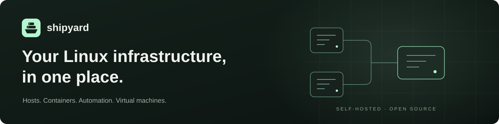

<p align="center">
  
</p>

<p align="center">
  <strong>A self-hosted home for your servers, containers, and everyday operations.</strong><br>
  Connect Linux hosts over SSH. See what needs attention. Run your next task from the browser.
</p>

<p align="center">
  <a href="#get-started">Get started</a> ·
  <a href="#connect-your-first-host">Your first host</a> ·
  <a href="#what-can-i-do-with-shipyard">Features</a> ·
  <a href="docs/README.md">Documentation</a> ·
  <a href="https://github.com/tobayashi-san/Shipyard/releases">Releases</a>
</p>

## Meet Shipyard

Shipyard brings Linux host management, Docker, Ansible, and Proxmox into one web
interface. Use it to check your homelab, maintain a group of servers, or give
your team a shared place to run infrastructure tasks.

Start with **one Linux host and an SSH connection**. Proxmox and OpenTofu
are optional. Host information is collected over SSH; no Shipyard agent is required.

> [!IMPORTANT]
> Install Shipyard on a private network or behind a VPN. It holds SSH credentials
> and can run commands on your hosts, so do not expose it directly to the internet.

## Get started

### 1. Prepare your Docker host

You need a Linux machine with **Docker Engine**, the **Docker Compose plugin**,
**Git**, and **OpenSSL** installed. Your user must be able to run Docker commands.
Shipyard's container includes its application dependencies; you do not need to
install Node.js, Ansible, or a separate database on this machine.

For a new installation, run:

```bash
git clone https://github.com/tobayashi-san/Shipyard.git
cd Shipyard
```

### 2. Create your configuration

The following commands copy the example and generate two different secrets
automatically. Run them once for a fresh installation:

```bash
cp .env.example .env
chmod 600 .env
sed -i "s/^JWT_SECRET=$/JWT_SECRET=$(openssl rand -hex 32)/" .env
sed -i "s/^SHIPYARD_KEY_SECRET=$/SHIPYARD_KEY_SECRET=$(openssl rand -hex 32)/" .env
```

Keep a secure backup of `.env`. In particular, `SHIPYARD_KEY_SECRET` is needed
to decrypt stored credentials. **Keep your existing `.env` when updating.**

### 3. Start Shipyard

```bash
docker compose pull
docker compose up -d --wait
docker compose ps
```

When the service is **healthy**, open **[https://localhost](https://localhost)**
in a browser on that same machine. The first visit shows a certificate warning
because Shipyard creates a self-signed certificate. Verify that you are visiting
your own installation before accepting it.

<details>
<summary><strong>Installing on a server without a browser?</strong></summary>

By default, Shipyard is only reachable from its Docker host. `localhost` on your
laptop refers to your laptop, not that server.

Open an SSH tunnel from your laptop, replacing `your-user@your-server` with your
server's SSH login:

```bash
ssh -N -L 8443:127.0.0.1:443 your-user@your-server
```

Leave the command running and open **[https://localhost:8443](https://localhost:8443)**
on your laptop. For regular access over a protected LAN, follow
[network and TLS configuration](docs/DOCKER_DEPLOYMENT.md#network-and-tls).

</details>

### 4. Complete the setup wizard

Create your administrator account, choose the appearance, and generate the SSH
key that Shipyard will use to connect to hosts. Select **Open App** when setup
is complete. There is no default username or password to look up.

## Connect your first host

Choose a Linux host you can already reach over SSH from the Docker machine.
Have its address, SSH port, and login user ready.

1. Open **Managed Hosts → Add host**.
2. Enter a display name, the **SSH address**, user, and port. The address must
   be reachable from Shipyard's container; the optional hostname field is only
   descriptive metadata.
3. Set up SSH access. You can supply the host's SSH password in the form to
   install Shipyard's public key and use **Test** to check the connection before saving.
   For key-only hosts, install the public key manually for the target user or
   follow the [SSH key import guide](docs/ssh-key-import.md).
4. Save the host, open its detail page, and check its connection status and
   system information. Then try the browser terminal.

Host registration and SSH-key deployment are separate steps: if key deployment
fails, the host can still be saved. Resolve the connection error before running
updates or automation. Those actions also need the appropriate permissions on
the target host.

**Your first useful result:** one connected host whose status you can inspect
and whose terminal you can open from Shipyard. No agent or Proxmox setup is
required for this.

## What can I do with Shipyard?

| I want to… | Shipyard provides |
| --- | --- |
| See which servers need attention | Host health, resource usage, pending updates, tags, groups, and environments |
| Work on a host from my browser | SSH terminals, SSH-key management, and SFTP file transfers |
| Manage containers and updates | Docker inventory, logs, Compose stacks, OS updates, and custom update tasks |
| Repeat a task across hosts | Ansible playbooks, variables and secrets, Git integration, schedules, and maintenance windows |
| Manage my Proxmox infrastructure | Platform and guest inventory, snapshots, power actions, and OpenTofu-managed VMs |
| Organize access and addresses | Roles and permissions, MFA, audit history, IP prefixes, and address reservations |

The interface is in English, with light/dark themes and customizable branding.
Webhook and email notifications help you follow operations outside the app.

<details>
<summary><strong>Hosts, Proxmox guests, and managed VMs—what is the difference?</strong></summary>

- A **managed host** is a Linux system Shipyard connects to over SSH for
  day-to-day operations. It can be a physical server or a virtual machine.
- A **Proxmox inventory guest** is a VM or container discovered through a
  connected Proxmox platform. Discovery alone does not set up SSH access.
- A **managed VM** is provisioned and tracked through Shipyard's OpenTofu
  workflow, with plans, apply operations, and drift checks.

You can connect an existing Linux guest as a managed host without rebuilding it.

</details>

## Need a hand?

| What you see | What to check |
| --- | --- |
| The page does not open | Run `docker compose ps`. Check whether your browser is on the Docker host; use the SSH tunnel above for a remote installation. |
| Port 443 is already in use | Set `SHIPYARD_PORT=8443` in `.env`, run `docker compose up -d --wait`, and open `https://localhost:8443` on the Docker host. Use the new server-side port in any SSH tunnel too. |
| A certificate warning | Expected with the generated self-signed certificate. The [TLS guide](docs/DOCKER_DEPLOYMENT.md#network-and-tls) explains using your own certificate. |
| The container does not become healthy | Run `docker compose logs --tail=100 shipyard` and check the reported error. Both secrets in `.env` must be present and different. |
| A host is saved but cannot connect | Check the SSH address, port, firewall, user, and installed public key. A successful save does not prove SSH access. |
| You see login instead of setup | Setup only appears when no users exist. Sign in with the account created for this installation. |

For a reproducible bug, [open an issue](https://github.com/tobayashi-san/Shipyard/issues)
with the image version, expected behavior, and relevant error. Remove credentials
and private host details before sharing logs; never attach `.env` or SSH keys.

## Keep your installation up to date

The default image tag, `latest`, follows **stable releases**. Release candidates
use explicit tags and do not replace `latest`. Features described on `main` may
be newer than your installed stable release.

Read the [release notes](https://github.com/tobayashi-san/Shipyard/releases) and
[back up your data](docs/README.md#backup-and-recovery) before updating. Then run
these commands from your existing Shipyard directory:

```bash
docker compose pull
docker compose up -d --wait
```

For predictable versions, set `SHIPYARD_IMAGE` in `.env` to
`ghcr.io/tobayashi-san/shipyard:<version>`, replacing `<version>` with a published
release tag without its leading `v`. Update that setting when moving to a new
release. Do not run `docker compose down -v` during an update: it deletes named
data volumes.

## Explore the documentation

| Guide | Use it for |
| --- | --- |
| [Deployment](docs/DOCKER_DEPLOYMENT.md) | LAN access, TLS, persistent storage, and configuration |
| [Backup and recovery](docs/README.md#backup-and-recovery) | Choosing database-only or application backups and planning a restore |
| [MFA](docs/mfa-policy.md) · [SSH keys](docs/ssh-key-import.md) · [Audit log](docs/audit-log.md) | Access configuration and operational history |
| [All documentation](docs/README.md) | Operator guides, development workflow, and historical records |

## Local development

Want to work on Shipyard's code? Use **Node.js 24** and npm. The complete
[development guide](docs/DEVELOPMENT_PIPELINE.md#local-development) covers setup,
checks, browser tests, and releases.

Shipyard uses React/TypeScript in `frontend-next/` and an Express/SQLite backend
in `server/`. The Docker installation above is the path for running the app;
the development guide is for changing it.

---

Self-hosted · Open source · [MIT licensed](LICENSE)
